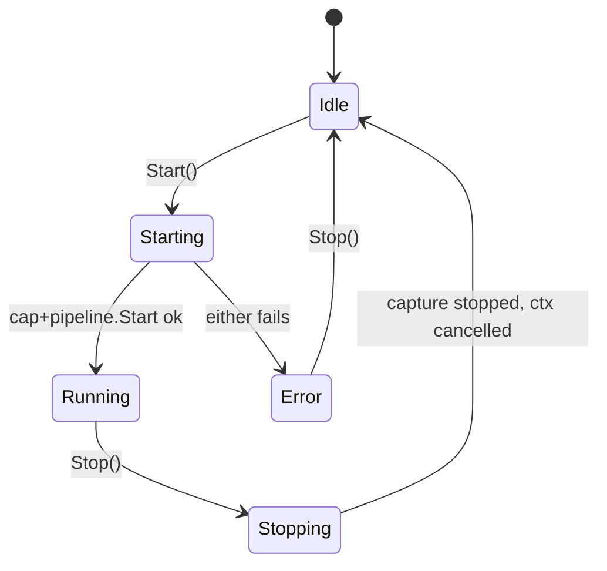

# STT Pipeline (M2)

Audio capture → VAD-segmented utterances → Whisper batch transcription → UI events. **No MT, no TTS, no playback** at this milestone — the playback device returns in [[../../wiki/08-Roadmap#M3|M3]] when TTS produces frames.

## Component layout

```
malgo capture (audio thread)
        │  WriteSamples([]int16)  ─── cgo, alloc-free
        ▼
sttSink (internal/app/ring_adapters.go)
        │  Pipeline.WriteFrame
        ▼
vad.Segmenter  (internal/audio/vad)
        │  Output() <-chan Utterance
        ▼
stt.Pipeline goroutine (internal/stt/pipeline.go)
        │  whisper.Engine.Transcribe (cgo)
        ▼
out chan stt.Event
        │
        ▼
UI consumer goroutine (cmd/translator/main.go)
        │  binding.String.Set
        ▼
Fyne transcript pane
```

## Thread model

| Goroutine | Role | Cgo? | Allocates? |
|---|---|---|---|
| miniaudio capture thread | Calls `sttSink.WriteSamples` | yes (C-owned) | no |
| Pipeline run | Reads `seg.Output()`, calls Whisper, sends events | yes (cgo whisper) | yes, but off audio thread |
| UI consumer | Reads `Pipeline.Output()`, appends transcript | no | yes |
| State poller (Fyne) | 200 ms ticker, refreshes status label | no | minor |

The miniaudio capture thread calls into the VAD segmenter directly — VAD frame buffering allocates only once per `New()`, and the cgo `WebRtcVad_Process` cost is ~100 ns per 30 ms frame. Acceptable on the audio thread; see [[../gotchas/Audio Thread No Allocation]] for the rules and exceptions.

## State transitions



State is `atomic.Int32`. UI polls; we do not push state changes via channel because the poll cadence (5 Hz) is cheaper than wiring a one-slot replace channel.

## Whisper engine reuse

The Whisper context is created via `model.NewContext()` on **every** `Transcribe` call rather than cached. Reasons:

- The upstream Go binding has no thread-safety guarantee for a shared `Context`. A fresh context is cheap (~50 ms) compared to the inference itself (200–400 ms on small).
- Initial prompt and language can change per-utterance; a cached context would need its parameters re-set anyway.

If profiling shows context creation dominates, we can introduce a `sync.Pool` of contexts.

## Backpressure

Two queues with explicit drop semantics:

1. **VAD output channel** — cap=4. Drops new utterances when the pipeline goroutine is stuck inside Whisper. This is the dominant slow stage.
2. **stt.Pipeline.out channel** — cap=`cfg.OutputBuffer` (8). Drops events when the UI consumer is slow (only happens if UI re-renders are heavy; in M2 this should never trigger).

> [!info] Why drop rather than block
> Blocking the segmenter consumer would not help — the segmenter still produces utterances at real-time pace from a streaming mic. Holding them up to slow disk/network/UI just delays the inevitable drop and makes the latency worse. Drop is the honest policy.

## Initial-prompt continuity

Each finished transcript is appended (trimmed to 200 runes) into a rolling `prompt` string that becomes the `InitialPrompt` for the next utterance. Improves consistency on long conversations — Whisper otherwise re-derives the language model state from scratch each time and may inconsistently capitalise names.

## Pending for M2b

- Sliding-window partial transcripts (every 1.5 s during ongoing utterance).
- Auto-download of the default model from the [[../../../internal/models/manifest/manifest.yaml|manifest]].
- WAV-file `--selftest` mode for CI smoke tests.
- Echo-cancellation hook for when M3 reintroduces playback.

## Source

- [[../../../internal/app/session.go|session.go]]
- [[../../../internal/app/ring_adapters.go|ring_adapters.go]]
- [[../../../internal/stt/pipeline.go|pipeline.go]]
- [[../../../internal/stt/whisper/whisper.go|whisper.go]]
- [[../../../cmd/translator/main.go|main.go]]
