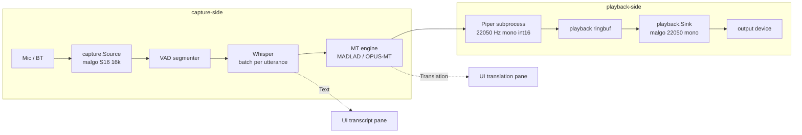

# TTS Stage (M3b)

M3b closes the audio loop by adding a Piper subprocess after MT and a malgo playback device after that. The end-to-end flow is now:

```
mic → VAD → Whisper → MT → Piper → ringbuf → malgo playback → speakers / (M4) virtual mic
```

## Component layout



## Threading

| Goroutine | Owner | Calls |
|---|---|---|
| miniaudio capture thread | malgo | sttSink.WriteSamples → VAD frame buffer |
| stt.Pipeline.run | session | VAD output channel → Whisper → MT → Piper → playbackSink.WritePCM |
| miniaudio playback thread | malgo | playbackSource.ReadSamples → ringbuf.Read |
| Events consumer | UI | stt.Pipeline.Output → Fyne string bindings |
| State poller | UI | 200 ms ticker, refreshes status label |

The pipeline goroutine is now responsible for **three** cgo/subprocess calls per utterance: Whisper, MT, Piper. The largest is MT (with MADLAD-3B); Piper subprocess spawn adds ~30–50 ms on top.

## Ring buffer between TTS and playback

22050 Hz mono int16, 65 536 samples = ~2.97 s capacity. Sized to absorb 1–2 utterances' worth of synthesised audio without dropping. Single-producer (pipeline goroutine), single-consumer (miniaudio thread) — matches the existing `internal/audio/ringbuf` contract.

When the ring is full, `playbackSink.WritePCM` makes two short-write attempts then drops the tail. This is the same "drop, don't block" principle as the segmenter→pipeline channel.

## Underrun handling

If the ring is empty when the playback callback fires (TTS is mid-synthesis, or no translation produced yet), `playback.Sink` fills the output with silence and increments its underrun counter. The UI displays both `Drops` (capture-side) and `Underruns` (playback-side).

## TTS bypass

If `Engine.HasVoice(targetLang)` returns false at session construction, the Session never opens the playback device and the pipeline never calls Piper. Transcript and translation panes still update — pure preview mode.

## End-to-end latency budget

```
mic frame                    20 ms
VAD hangover                300 ms
Whisper-small                300 ms
MT (MADLAD-3B int8)         800 ms
Piper medium voice          200 ms (incl. spawn)
playback queue                50 ms
───────────────────────────────────
total (post-mic, p50)      ~1.7 s
total (post-mic, p95)      ~2.4 s
```

p95 slightly above the [[../../wiki/07-Performance|2.0 s target]]. To shrink: switch to `--json-input` long-lived Piper subprocess (-100 ms) and/or use OPUS-MT for the chosen pair (-600 ms). The user can do both via flags.

## Source

- [[../../../internal/tts/piper/piper.go]] — wrapper
- [[../../../internal/stt/pipeline.go]] — TTS hook (`handleUtterance`)
- [[../../../internal/app/session.go]] — device wiring
- [[../../../internal/app/ring_adapters.go]] — playbackSink / playbackSource
- [[../../../cmd/translator/main.go]] — `--tts`, `--voice` flags
