# VAD Segmentation

How we turn an infinite PCM stream into bounded utterances for STT.

## Parameters

```
SampleRate     = 16000
FrameMs        = 30          (480 samples)
Aggressiveness = 2           (WebRTC mode 0..3)
MinSpeechMs    = 200         (drop noise bursts)
MaxSpeechMs    = 15000       (force close monologues)
HangoverMs     = 300         (silence to close)
PrePadMs       = 150         (frames kept before onset)
```

## State machine

```mermaid
stateDiagram-v2
    [*] --> Idle
    Idle --> Idle: VAD inactive (roll pre-pad ring)
    Idle --> Speaking: VAD active
    Speaking --> Speaking: VAD active (reset silence counter)
    Speaking --> Closing: VAD inactive (start silence counter)
    Closing --> Speaking: VAD active (drop silence counter)
    Closing --> Emit: silenceMs >= HangoverMs
    Speaking --> Emit: speechMs >= MaxSpeechMs
    Emit --> Idle: if speechMs >= MinSpeechMs, send Utterance; else drop
```



## Pre-pad ring

When idle, every frame is pushed into a small ring of `PrePadMs / FrameMs` slots. On onset, the ring is prepended to the utterance buffer. This recovers the first ~150 ms of audio that the VAD did not yet flag as speech — usually the unvoiced consonants at the start of a word.

## Hangover

After the VAD goes inactive we keep appending frames for `HangoverMs` more. Two reasons:

1. Mid-sentence pauses (intra-word, breath, stops) should not split the utterance.
2. Whisper benefits from trailing silence to detect the end of the last word and decide whether to emit a token.

The trailing silence is included in `Utterance.PCM` (Whisper consumes it). It is **excluded** from `Utterance.Duration` to keep the metric honest — see [[../gotchas/VAD Hangover Inflates Duration]].

## Sliding window vs VAD-batched

Two ways to feed Whisper:

| Approach | When to use |
|---|---|
| **VAD-batched** (current) | Easy, single-pass, no overlap merging. Latency = utterance length + hangover (~1.5–4 s typically). |
| **Sliding window + partial** | Better perceived latency (first partial in ~1.5 s). Requires de-duplicating tokens that show up in overlapping windows. Plan for M2b. |

## Bluetooth interaction

When the mic is a BT headset, switching to HFP mode drops the effective sample rate to 8/16 kHz mono — fine for VAD. But playback quality also drops. See [[Bluetooth HFP Trap]].

## Source

- [[../../../internal/audio/vad/vad.go|vad.go]]
- [[../libraries/go-webrtcvad]]
