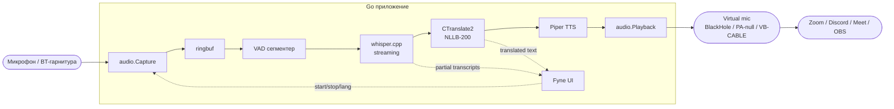

# 01 — Архитектура

## Высокоуровневый поток



## Goroutine-модель

Каждая ступень — отдельная goroutine, связанная буферизированными каналами с ограниченной ёмкостью. Это даёт естественный **backpressure**: когда STT не успевает, capture goroutine блокируется на send и DMA-буфер audio-устройства начинает дропать сэмплы (а не RAM приложения раздувается).

| Goroutine | Назначение | OS thread lock | Канал-выход (cap) |
|---|---|---|---|
| `capture` | Чтение из audio device → ringbuf | да (`runtime.LockOSThread`) | `chan []int16` (cap=8) |
| `segmenter` | VAD, нарезка на utterances | нет | `chan Utterance` (cap=4) |
| `stt` | Streaming Whisper (partial+final) | нет | `chan Transcript` (cap=4) |
| `mt` | NLLB перевод final-сегментов | нет | `chan Translation` (cap=4) |
| `tts` | Piper синтез PCM | нет | `chan []int16` (cap=4) |
| `playback` | Запись в virtual mic | да | — |
| `ui-update` | Агрегация partial/translation для UI | нет | — |

При перегрузке STT — partial-результаты дропаются, finals удерживаются (поведение `select` с default-веткой для partial-канала).

## Композиция (`internal/app`)

```go
type Session struct {
    cfg       *config.Config
    cap       *capture.Source
    vad       *vad.Segmenter
    stt       stt.Engine
    mt        mt.Engine
    tts       tts.Engine
    play      *playback.Sink
    pipeline  *pipeline.Orchestrator
    ctx       context.Context
    cancel    context.CancelFunc
}

func (s *Session) Start(ctx context.Context, src, dst lang.Code) error { ... }
func (s *Session) Stop() error { ... }
```

Lifecycle: `New → LoadModels → Start → ... → Stop → UnloadModels (idle timer) → Close`.

## Граница cgo

Только три cgo-биндинга:

1. **whisper.cpp** — через `github.com/ggerganov/whisper.cpp/bindings/go`.
2. **CTranslate2** — собственная обёртка (нет готового Go-биндинга). Файл `internal/mt/ct2/cgo.go`. Линкуется со статической libctranslate2.a.
3. **Piper / onnxruntime** — собственная тонкая обёртка над C API piper или прямой вызов onnxruntime + sentencepiece для G2P.

Аудио использует `gen2brain/malgo` (миниaudio cgo) — это четвёртый cgo-блок, но он де-факто стандарт для cross-platform audio в Go.

## Контекст и cancel

Каждая ступень принимает `context.Context`. `Stop()` отменяет корневой ctx, все goroutine выходят, ресурсы освобождаются через `defer`. Модели остаются в RAM ещё `cfg.IdleUnloadAfter` (default 5 мин), чтобы быстрый рестарт не требовал повторной загрузки.

## Состояние сессии

`type State int32` (atomic): `Idle | Loading | Listening | Speaking | Error`. UI подписывается через `chan State` (cap=1, replace-on-full) и перерисовывает индикатор.

## Конфигурация

Файл `config.yaml` в:

- macOS: `~/Library/Application Support/realtime-speech-translator/`
- Linux: `$XDG_CONFIG_HOME/realtime-speech-translator/`
- Windows: `%APPDATA%\realtime-speech-translator\`

Пример:

```yaml
audio:
  input_device: "auto"
  output_device: "BlackHole 2ch"
  monitoring: false
  monitoring_device: "default"
models:
  whisper: "small"
  mt: "nllb-200-distilled-600M-int8"
  tts:
    en: "piper-en-US-amy-medium"
    ru: "piper-ru-RU-irina-medium"
performance:
  threads: 0  # auto = NumCPU/2
  vad_aggressiveness: 2
  idle_unload_after: 5m
```
